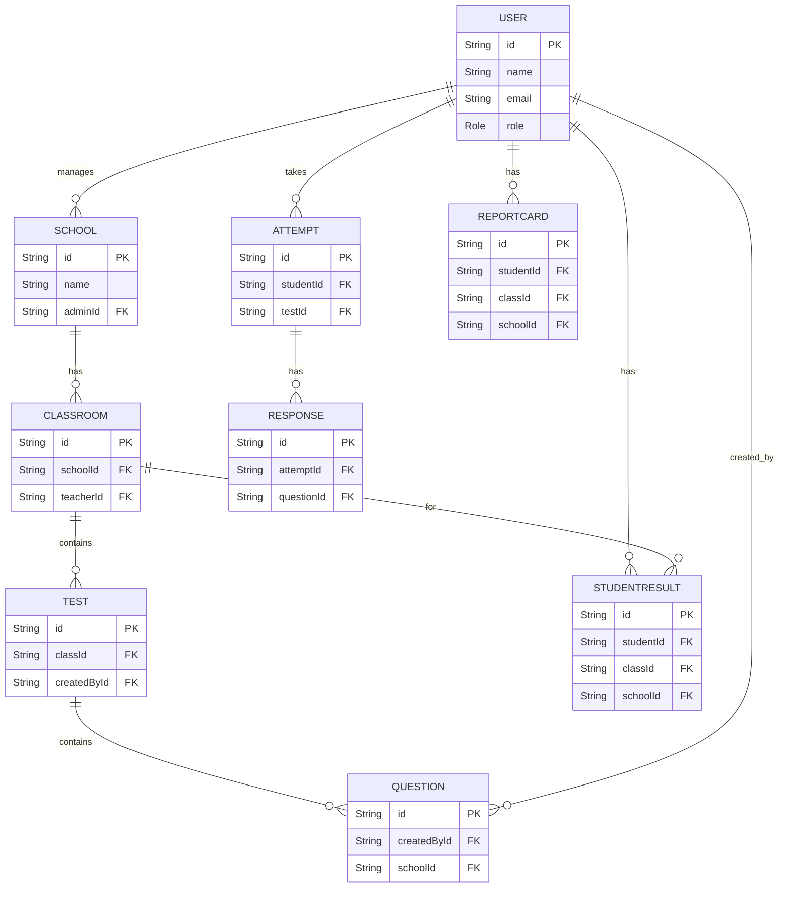

# System Architecture — CBT Platform

## Overview
This document summarizes the high-level architecture for the CBT platform: frontend (React/Vite admin UI), backend API (NestJS + Prisma), primary data store (Postgres), file storage (uploads), and realtime/notifications.

- Backend: `cbt-software/backend-nestjs` (NestJS modules, Prisma schema)
- Frontend: `cbt-software/frontend/cbt-admin-frontend` (React + Vite)
- Database: PostgreSQL (schema defined in `cbt-software/backend-nestjs/prisma/schema.prisma`)
- File storage: `/uploads` (local or cloud bucket)
- Auth: JWT (NestJS `auth` module)

## System Context (Mermaid)

```mermaid
flowchart LR
  User[Users (Students / Teachers / Admins)]
  Frontend[Admin Frontend (React/Vite)]
  API[Backend API (NestJS)]
  DB[(Postgres)]
  Storage[(File Storage)]
  Auth[(Auth: JWT)]
  Worker[(Background Jobs / Workers)]

  User -->|browser| Frontend
  Frontend -->|HTTP / REST / WebSocket| API
  API -->|ORM (Prisma)| DB
  API -->|uploads| Storage
  API -->|issue/verify tokens| Auth
  API -->|enqueue jobs| Worker
  Worker --> DB
  Worker --> Storage
```

## Component Diagram (Mermaid)

```mermaid
flowchart TB
  subgraph Frontend
    FE[Admin UI]
    CP[Command Palette]
    AS[AppShell]
  end

  subgraph Backend
    API[HTTP API (NestJS)]
    AUTH[Auth Module (JWT)]
    PRISMA[Prisma Client]
    NOTIF[Notifications / WebSockets]
    FILES[File Uploads Service]
    JOBS[Background Jobs]
  end

  FE --> API
  API --> PRISMA
  API --> AUTH
  API --> FILES
  API --> NOTIF
  API --> JOBS
  JOBS --> PRISMA
  NOTIF --> FE
```

## ERD (simplified) — generated from `prisma/schema.prisma`



## Links & Notes

- Full Prisma schema: [cbt-software/backend-nestjs/prisma/schema.prisma](cbt-software/backend-nestjs/prisma/schema.prisma)
- Backend entry: [cbt-software/backend-nestjs/src/app.module.ts](cbt-software/backend-nestjs/src/app.module.ts)
- Frontend entry: [cbt-software/frontend/cbt-admin-frontend/src/main.jsx](cbt-software/frontend/cbt-admin-frontend/src/main.jsx)
- Diagram sources: [cbt-software/ARCHITECTURE/diagrams/system.mmd](cbt-software/ARCHITECTURE/diagrams/system.mmd)
- Component source: [cbt-software/ARCHITECTURE/diagrams/component.mmd](cbt-software/ARCHITECTURE/diagrams/component.mmd)
- ERD source: [cbt-software/ARCHITECTURE/diagrams/erd.mmd](cbt-software/ARCHITECTURE/diagrams/erd.mmd)
- Render instructions: [cbt-software/ARCHITECTURE/diagrams/README.md](cbt-software/ARCHITECTURE/diagrams/README.md)

## Next steps (suggested)
- Add ADRs (architecture decisions) under `cbt-software/ADR/`.
- Generate OpenAPI/Swagger for the NestJS API (or enable runtime Swagger via `ENABLE_SWAGGER=true`).
- Add a `DEV_SETUP.md` for running locally (migrations/seeding).

---
Generated on: 2026-04-29
